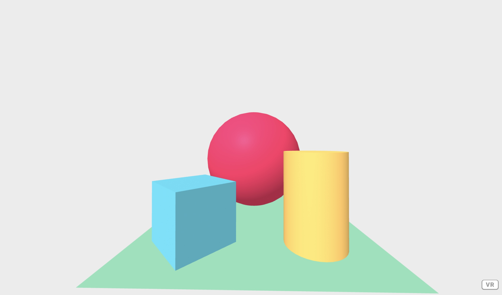

# The Hic et Nunc Metaverse Tutorial Series

## Part 1: Enter the Micro-Metaverse

Hi and welcome to a brand new series of tutorials that are intended as an introduction into WebXR and NFTs. 

"**Metaverse**" is a term that currently pops up everywhere. Some see it as a decentralized futuristic space linking Virtual / Augmented Realities and blockchains. Others claim that they are already building it (in which case there must be more than one Metaverse, and we probably would need a Meta-Meta-verse). And still others note that the origin of the concept is a [quite dystopian one](https://en.wikipedia.org/wiki/Snow_Crash) and therefore it should rather be avoided.

I use **Metaverse** to describe a potential open and decentralized Web 3.0. Imagine various VR / AR / NFT / IoT / data / smart contract layers built on open web standards that we all use and build upon. Decentralized means that you, me and everyone else can run their own stuff and own their data, instead of the current, largely corporation-owned walled gardens and social media conglomerates, a.k.a. the late Web 2.0. My tutorials therefore contain 100% open source, web-based ingredients such as [WebXR](https://www.w3.org/TR/webxr/).

[**Hic et Nunc** ](https://www.hicetnunc.xyz/) (HEN, or H=N) is one of the fastest growing NFT platforms. At the same time it has established itself as a place for a diverse community of artists and collectors. HEN is [open source](https://github.com/hicetnunc2000/) and lives on [Tezos](https://tezos.com/), a "green"/[energy efficient](https://arxiv.org/abs/2109.03667) blockchain. You can read about the history of Hic et Nunc [here](https://github.com/i3games/hen-timeline/blob/main/timeline.md).

So we start with the tiny little atom of a Metaverse, possibly, and watch it grow in size and capacity. The main goal is to learn about WebXR and experiment with green NFTs.

Ready? This is the roadmap:

**Tutorial 1: Enter the Micro-Metaverse**.  
The tutorial you are reading right now is the first part of the series. We set up some tools and create a tiny virtual world that contains a link to an NFT. It also has an object that responds to a click event (more on that below). By activating the object it calls a blockchain service to display the balance of a Tezos address that we enter.

This is what we will see at the end:


**Tutorial 2: Wallets and Transactions**.  
In part 2 of the series we are going to buy a NFT from our virtual world by calling a smart contract. We will learn how to interact with a wallet to confirm the transaction.

**Tutorial 3: Writing a Smart Contract for Interaction**.  
In part 3 we finally write our own smart contract in order to facilitate an interaction between collectors in Virtual Reality.

**Tutorial 4: ???**  
Like a certain movie franchise, part 4 is unknown yet but it might bring joy and resolution to the series. I was recently invited to play with [Neural Cellular Automata](https://distill.pub/2020/growing-ca/), so maybe we can go in this direction. But first things first.

## Prerequisites

These tutorials assume that you know how to install software, create files and folders, use a code editor and run commands from the terminal (also called "command line" or "shell"). Experience in HTML, CSS and JavaScript (tutorial 1 and 2) and in Python (tutorial 3) are a plus, but not required. If you do not know how to code (yet) just follow along and learn more with the resources provided below.

We will start from scratch and work all the way through towards blockchain programming. Therefore each tutorial has to cover a lot of ground. To pull this off, I keep implementation and tooling minimal and provide additional material and optional parts for those who want to explore specific topics further.

My goal is to explain things so that everyone is able to follow, regardless of your background. If something is still unclear or if you spot a mistake, please leave a bug report on the Github repository. Thereby you can help improve the tutorials for yourself and for others.

Let's go.

## 1. Preparation and Setup

You need the following set of tools to follow the first tutorial:

1. A laptop or PC with an up to date web browser such as Chrome (recommended for VR) or Firefox.
2. A code editor. I use Visual Studio Code (VS Code).
3. A terminal (also called "command line" or "shell"). VS Code has a terminal built in `(Terminal -> New Terminal)`.
4. A local web server. VS Code has an extension called "Live Server", which comes handy. Extensions in VS Code are installed from the Extension panel `(View -> Extensions)` by entering their name in the search field and following the instructions.
5. npm, the node.js package manager.

These tools we will also be using during this course. If you are just getting started, follow the links at the end of the article to install them. If you are advanced, feel free to use your favourite editor / server / package manager instead.

5. I recommend for this tutorial to have your own Tezos wallet, and in the second tutorial you need one. I use the Temple wallet with Chrome. You also need a small amount of Tez (probably less than 1 Tez overall) in order to buy an NFT in tutorial 2 and for the interactions in tutorial 3.
6. In tutorial 3 we will use [SmartPy](https://smartpy.io/) to write a smart contract. To test the contract you will need two Tezos addresses which both own an NFT on Hic et Nunc.

## 2. Create a minimal VR Scene with A-Frame

First let us create a small VR scene to start with.

Everything starts with an empty folder. Create a folder for this project. Then open it in VS Code (To do that on my Mac, I drag the directory from the Finder window to the VS Code icon in the Dock). This allows you to work in the code editor, add files to the project and edit them. Visit the A-Frame website and take the code from their [introduction tutorial](https://aframe.io/docs/1.2.0/introduction/):

```html
<html>
  <head>
    <script src="https://aframe.io/releases/1.2.0/aframe.min.js"></script>
  </head>
  <body>
    <a-scene>
      <a-box position="-1 0.5 -3" rotation="0 45 0" color="#4CC3D9"></a-box>
      <a-sphere position="0 1.25 -5" radius="1.25" color="#EF2D5E"></a-sphere>
      <a-cylinder
        position="1 0.75 -3"
        radius="0.5"
        height="1.5"
        color="#FFC65D"
      ></a-cylinder>
      <a-plane
        position="0 0 -4"
        rotation="-90 0 0"
        width="4"
        height="4"
        color="#7BC8A4"
      ></a-plane>
      <a-sky color="#ECECEC"></a-sky>
    </a-scene>
  </body>
</html>
```

Then copy and paste the code into a file and save it as `index.html`. Open the directory in VS Code. Now click on the button labelled "Go Live" in the bar at the bottom of the window to start Live Server. Your web browser should pop up. You will first get a warning, because we are using `http:` instead of a secure connection over `https:`, which is ok for local development. Maybe you have to search a bit in the message, but your browser will let you chose to display the page and you will see this:



This is our VR world. Impressed? You can move in the scene with the WASD-keys, click and drag the mouse to rotate. Note the little VR button in the lower right corner. You can open this page with your favourite VR glasses or in your smartphone with a [cardboard VR viewer](https://arvr.google.com/cardboard/), tap the button and you will be ... in the scene.

The scene lives inside a web page. The part between the opening tag `<a-scene>` and the closing tag `</a-scene>` describes the elements that you can see here. For example, `<a-box position="-1 0.5 -3" rotation="0 45 0" color="#4CC3D9"></a-box>` means that there is a box in the scene at position -1 on the left-right axis, 0.5 on the up-down axis, -3 on the front-back axis, rotated by 45 degrees with [this particular color](https://www.google.com/search?q=%234CC3D9).

To get a feeling for this A-Frame scene, I recommend to study the other elements and change some of their attributes like the position, then save the file to see what happens. If you have Live Server installed, it will update the browser window instantaneously. When you run into errors, try to figure out what went wrong. When you are done, copy the original code from the A-Frame website again or keep working with your modified scene if you prefer.

## 3. Display an NFT and link to its page on HEN

In this step, we want to be able to click on the image of an NFT to open its page on Hic et Nunc.

Insert the following code right before the closing `</a-scene>` tag.

```html
<a-plane
  position="-3.5 1.85 -5"
  rotation="0 20 0"
  width="4.5"
  height="4.5"
  src="https://ipfs.io/ipfs/QmZEXZrnWcutQLZg1zmXFE5s9L2YfRcQSckMoyR68u7hBx"
  class="clickable"
  henlink="url: https://www.hicetnunc.xyz/objkt/181212; loc: frame"
></a-plane>
```

This adds our NFT billboard, a plane with the image of an NFT (that I made for these tutorials, please excuse the art). In the second tutorial we will be able to collect this NFT directly. For now, we display its image, which is stored on the "Interplanetary File System", or IPFS for short. The `src` attribute of the `<a-plane>` element points to its IPFS address: `https://ipfs.io/ipfs/QmZEXZrnWcutQLZg1zmXFE5s9L2YfRcQSckMoyR68u7hBx`. To get this address, go to the NFT page on Hic and Nunc, in this case [https://www.hicetnunc.xyz/objkt/181212](https://www.hicetnunc.xyz/objkt/181212), and right-click on the image. In Chrome, there will be an entry named "Copy Image Link".

Other attributes such as `position`, `rotation`, `width` and `height` should be familiar by now. `class="clickable"` and `henlink="url: https://www.hicetnunc.xyz/objkt/181212; loc: frame"` will become clear in a moment.

To be able to click on that image and open its linked page on HEN, we need two more items: a kind of cursor to do the click and code that reacts to the click and opens the NFT page in a new tab or window.

First, add the following code to the scene. As before, insert it immediately before the closing `</a-scene>` tag.

```html
<a-entity position="0 0 0" rotation="0 -17 0">
  <a-camera id="player">
    <a-entity
      raycaster="objects: .clickable"
      id="cursor"
      cursor
      geometry="primitive: ring"
      material="color: green; shader: flat"
      position="0 0 -0.5"
      scale="0.01 0.01 0.01"
    >
    </a-entity>
  </a-camera>
</a-entity>
```

The three nested elements represent the player in the scene. The outer `a-entity` sets the initial position, the `a-camera` creates the "eyes" of the player and the inner `a-entity` a cursor that appears as a green ring and is able to click on elements whose `class` is `"clickable"`. Note that if we do not explicitly add a camera to the scene, A-Frame provides a default one.

Until now, we have described elements in the scene. Now we want to add code that is executed dynamically when something happens, in our case a click on the element. This code is written in [JavaScript](https://developer.mozilla.org/en-US/docs/Learn/JavaScript), the main programming language of the web. In A-Frame, it is considered best practice to write [components](https://aframe.io/docs/1.2.0/introduction/writing-a-component.html), reusable pieces of code that provide attributes for the elements. The `henlink` attribute on the `<a-plane>` element above points to the component that we are going to write now.

Create a new file called `main.js` and put the following code in it.

```javascript
AFRAME.registerComponent('henlink', {
  schema: { url: { type: 'string' } },
  init: function () {
    console.log('registering component henlink');
  },
  update: function () {
    const url = this.data.url;
    this.el.addEventListener('click', function (evt) {
      window.open(url, '_blank');
    });
  },
});
```

Here you can see the name of the component, `henlink`, which matches the name of the attribute in the `<a-plane>` element above. This links the code in the component to the element. Furthermore, the component has three properties:

- `schema` describes the parameters of the component. We define a parameter of type `string` which is called `url`.
- `init` is a function that is called once when the component is initialized. I have added a line of code that writes a message to the web browser console, in order to check if the component has been added. In Chrome, `View -> Developer -> JavaScript console` displays these messages and also possible errors, which is useful to check if things go wrong.
- `update` is another function that is called when the component is initialized and when a property of the component is updated. Our code gets the URL from the schema and registers an event listener that opens this URL in a new browser tab or window.

More about components and their properties can be found in the excellent [A-Frame documentation](https://aframe.io/docs/1.2.0/core/component.html).

The final step is to tell `index.html` about the code in `main.js`. Go back to index.html and add the line

```html
<script src="main.js"></script>
```

after the first `<script src...` and before the closing `</head>` tag. Save both files, and Live Server should update the scene in the browser window.

Now move the green cursor over the image and click on it. Its [Hic et Nunc page](https://www.hicetnunc.xyz/objkt/181212) opens in a new tab.

At this point, this is the complete `index.html`. I added two lines near the top to help the browser understand the content:

```html
<!DOCTYPE html> <!-- added for the browser -->
<html>
  <head>
    <meta charset="utf-8" /> <!-- added for the browser -->
    <script src="https://aframe.io/releases/1.2.0/aframe.min.js"></script>
    <script src="main.js"></script>
  </head>
  <body>
    <a-scene>
      <a-box position="-1 0.5 -3" rotation="0 45 0" color="#4CC3D9"></a-box>
      <a-sphere position="0 1.25 -5" radius="1.25" color="#EF2D5E"></a-sphere>
      <a-cylinder
        id="balance"
        class="clickable" 
        position="1 0.75 -3"
        radius="0.5"
        height="1.5"
        color="#FFC65D"
      ></a-cylinder>
      <a-plane position="0 0 -4" rotation="-90 0 0" width="4" height="4" color="#7BC8A4"></a-plane>
      <a-sky color="#ECECEC"></a-sky>
      <a-plane
        id = "nft"
        class="clickable"
        position="-3.5 2.3 -5"
        rotation="0 20 0"
        width="4.5"
        height="4.5"
        src="https://ipfs.io/ipfs/QmZEXZrnWcutQLZg1zmXFE5s9L2YfRcQSckMoyR68u7hBx"
        henlink="url: https://www.hicetnunc.xyz/objkt/181212"
      >
      </a-plane>
      <a-entity position="0 0 0">
        <a-camera id="player">
          <a-entity
            raycaster="objects: .clickable"
            id="cursor"
            cursor
            geometry="primitive: ring"
            material="color: green; shader: flat"
            position="0 0 -0.5"
            scale="0.01 0.01 0.01"
          >
          </a-entity>
        </a-camera>
      </a-entity>
    </a-scene>
  </body>
</html>
```

This is the content of `main.js`:

```javascript
AFRAME.registerComponent('henlink', {
  schema: { url: { type: 'string' } },
  init: function () {
    console.log('registering component henlink');
  },
  update: function () {
    const url = this.data.url;
    this.el.addEventListener('click', function (evt) {
      window.open(url, '_blank');
    });
  },
});
```

If you want to go further, you could extend the mouse-triggered interaction to also work in VR. This can be done in two ways, either with a VR controller or with gaze-based interaction, for example on a smartphone with a cardboard VR viewer. The A-Frame documentation has [details](https://aframe.io/docs/1.2.0/introduction/interactions-and-controllers.html). 

Congratulations! We reached an important milestone: a VR scene that reacts to interaction. For example, you could now go on and build a VR gallery with your favourite NFTs. 

## 4. Prepare your development pipeline 

During the next steps of this tutorial we will have a first look at the Tezos blockchain. Maybe the visitor of your NFT gallery wants to know if they have enough Tez (the currency of Tezos) in their account to buy an NFT that is on display? In tutorial 2 we will learn how to talk to their wallet directly, but for now I am using a service to look up the balance. For our visitor, the experience is as follows: they enter their Tezos address, then click on the yellow cylinder in the scene, then the balance will pop up as 3D Text.

Before we can continue coding, we need to install additional libraries.  

One is [Taquito](https://tezostaquito.io/), the framework that will provide us with functions to talk to the blockchain. Taquito is written in [TypeScript](https://www.typescriptlang.org/), a quite popular superset of JavaScript. We will use a tool named [Parcel](https://parceljs.org/) to integrate Taquito into our code and to build the web app for us. To install these dependencies, we use `npm` which we already have installed above.

Open a terminal window (`Terminal -> New Terminal` in VS Code), type `npm init --yes` and press Return. In case you are using a different terminal program, make sure to do this inside the folder where `index.html` is located. A file named `package.json` appears. It holds various information about the project and we will look into it in a moment.

Type `npm install @taquito/taquito` and press Return. You will see activity in the terminal and a folder named `node_modules` appears.

Type `npm install --save-dev parcel` and press Return. Again the terminal will get busy for a while.

Wait between each step until the installations have completed. `npm` pulls stuff from repositories on the web, thus it is preferable to have a stable internet connection.

As more files and folders appear, our project folder gets a little bit unwieldy. Before we go on, let us therefore reorganize a bit. In the project folder, make a folder `src`. Move both `index.html` and `main.js` into this folder. Also in the project folder, make another folder `dist`. This one remains empty for the moment. 

Now, open `package.json` in VS Code. This is the configuration file for our project. Delete the line that says `"main": "index.js"`. Then add the following three lines right below the line that says `"scripts": {`

```json
"clean": "rm -rf dist/*",
"build": "parcel build src/index.html",
"watch": "parcel watch src/index.html",    
```

Make sure you don't forget the trailing comma or VS Code will complain. These configurations give us new commands for `npm` to build the app and to clean the build folder. Save `package.json`. In the terminal, type `npm run watch` and press Return. From now on, each time Parcel detects a change in the source files, it will rebuild the app inside the `dist` folder that we created earlier. So, `src` contains the source files we are working on and `dist`, which stands for "distributable", contains the final output. In between the two Parcel does its magic. This kind of organisation has become standard practice in web development.

Because the app is now built inside the `dist` folder, we have to tell Live Server to look there. (Note for advanced readers: in this tutorial, I prefer to use Parcel for building only and Live Server to display the output from Parcel. If you know Parcel, feel free to configure it for hot reload as well.)

In VS Code, select `Preferences -> Settings -> Extensions -> Live Server Config`.

Scroll down to `Settings: Wait`. Change the default value from 100 to 500 milliseconds. 

Scroll further down to `Root -> Edit in settings.json`. Click on the link and in the file `settings.json` that pops up, edit the line as shown below. 

```json
 "liveServer.settings.root": "/dist", 
```

Save the file. Then stop and restart Live Server with the button in the status bar at the bottom of the VS Code window. You should see our 3D scene in the browser window again.    

On the surface, it seems we are back where we were in the previous step, yet under the hood we have achieved a lot. In particular, we now have a development pipeline in place that allows us to continue with the next steps. If all this is new for you, you might wonder if coding always involves such a large amount of configurations and setup. The answer is: it depends on the particular project and coding environment, but often these steps are not spelled out explicitly. 

## 5. Get blockchain data with Taquito

Now we will connect to the Tezos blockchain through the Taquito library we installed in the previous step. 

First create a new file `app.js` and save it in the `src` folder.

```javascript
import { TezosToolkit } from '@taquito/taquito';

export class App {
  constructor (rcpClient = 'https://api.tez.ie/rpc/mainnet') {
    this.tk = new TezosToolkit(rcpClient);
  }

  init (address) { this.address = address; }

  async getBalance (address = this.address) {
    let balance = 0.0;
    try {
      const rawBalance = await this.tk.rpc.getBalance(address);
      balance = rawBalance.toNumber() / 1000000;
    } catch (error) {
      console.error("Could not get a balance. Check the address you entered and try again.");
    }
    return balance;
  }
}
```

This code declares a class `App` with a method `init` that allows us to set a Tezos address and another method `getBalance` that returns the balance for that address. Our class uses the `TezosToolkit` class provided by Taquito. The data is pulled from a public node on the Tezos blockchain: `https://api.tez.ie/rpc/mainnet`.

Now we will make use of that functionality in our `main.js`. 

First, let's add a second component named `balance`. 

```javascript
AFRAME.registerComponent('balance', {
  schema: {},
  init: function () {
    console.log('registering component balance');
  },
  update: function () {
    this.el.addEventListener('click', async function (evt) {
      console.log('click on component balance');
      const balance = await app.getBalance();
      const textGeometryAttribute = `value: ${balance} Tz; font: #comic-sans-bold`;
      document.querySelector('#balance').setAttribute('text-geometry', textGeometryAttribute);
      console.log(balance);
    });
  }
});
```

We want to link that component to the yellow cylinder that sits on the right side of our scene. What it does is to call the method `app.getBalance()` that we defined in `app.js` and to transform the resulting value into text inside our scene. For this component to work, first we have to pull in the class from `app.js`. We also must instantiate that class by creating an object. At the top of `main.js`, add the following two lines:

```javascript
import { App } from './app';
const app = new App();
```

When you save the file, Parcel will immediately complain in the terminal window. First it says "Build failed." written in red which tells us something is wrong, then it gives the reason "Browser scripts cannot have imports or exports.", followed by the offending places. 

If you want to understand precisely what is going on here, I recommend having a look at the documentation of [ES 6 modules](https://developer.mozilla.org/en-US/docs/Web/JavaScript/Guide/Modules). To fix the issue, open `index.html`, find the line starting with `<script src="main.js"` and change it to:   

```html
<script src="main.js" type="module"></script>
```

This change is necessary for Parcel to work again, however it will throw off A-Frame, which won't put out an error message but silently fails to connect the two components in `main.js` to the elements in the scene. A bit of work is necessary to adapt our code to the new situation.

At the bottom of `main.js`, add: 

```javascript
const nft = document.querySelector('#nft');
nft.setAttribute('henlink', 'url: https://www.hicetnunc.xyz/objkt/181212');                         

const balance = document.querySelector('#balance');
balance.setAttribute('balance', '');     
```

This piece of code is meant to look for the plane and for the cylinder in our scene and add the two components to it. We must edit both elements in `index.html` to make this happen.

In our NFT billboard, add `id = "nft"` and remove `henlink="url: https://www.hicetnunc.xyz/objkt/181212"` which is no longer needed here. In the yellow cylinder, add the attribute `id="balance"` and `class="clickable"`.

The description for the NFT billboard link looks now like this: 

```html
<a-plane
  id = "nft"
  class="clickable"
  position="-3.5 2.3 -5"
  rotation="0 20 0"
  width="4.5"
  height="4.5"
  src="https://ipfs.io/ipfs/QmZEXZrnWcutQLZg1zmXFE5s9L2YfRcQSckMoyR68u7hBx"
></a-plane>
```
...and the cylinder like this:

```html
<a-cylinder
  id="balance"
  class="clickable" 
  position="1 0.75 -3"
  radius="0.5"
  height="1.5"
  color="#FFC65D"
></a-cylinder>
```

Wait until Parcel has finished rebuilding the code and test the scene by clicking on the NFT billboard and one the cylinder. The NFT link should open in a new tab or window as before, but the cylinder does not work as intended, mainly because we haven't told it the Tezos account address yet. If you look into the browser console (in Chrome: `View -> Developer -> JavaScript console`) you see a couple of error messages. In the next step we are going to add the missing piece.

## 6. Enter a Tezos account address

Each transaction and each account on the blockchain is public, so you can look up an account balance with a blockchain explorer like [tzkt.io](https://tzkt.io/). A Tezos account address looks like a string of letters and numbers, for example this one:  "tz1imNpo5WeCoE5cziWsdpiaThT8YgvbTtJ9". On Hic et Nunc you can view the artist's page for this address: [https://www.hicetnunc.xyz/tz/tz1imNpo5WeCoE5cziWsdpiaThT8YgvbTtJ9](https://www.hicetnunc.xyz/tz/tz1imNpo5WeCoE5cziWsdpiaThT8YgvbTtJ9). It is Mikrosil, an illustrator who uses strong colours to produce cheerful images and animations. 

To get a feeling for them, look up a few addresses on Hic et Nunc and tzkt.io. Use your own address if you already have a wallet. A reminder, in the second tutorial you will need a wallet in order to buy an NFT on Hic et Nunc. 

As the Tezos account address is a long string, it wouldn't be fun to enter it character by character in our 3D scene. Instead, we will use a standard HTML form field where we can copy and paste an address into. Let's prepare this now.

Insert the HTML for the text field before the `<a-scene>` tag. Make sure to insert it before the scene and not inside `<a-scene>...</a-scene>`, as the form field is not part of the 3D environment.

```html
<div id="enteraddress">
  <h4>Tezos Address</h4>
  <p>
    Enter your Tezos wallet address and click on the cylinder to see your
    balance. Click on the image to open it's H=N OBJKT page.
  </p>
  <input id="address" type="text" size="40" class="validate" />
  <label class="active" for="address">Tezos address</label>
  <a
    href="#!"
    id="enteradddress"
    >Enter</a
  >
</div>
```

If you look at the page now, you can see the parts we just added, but the 3D scene is gone. Actually, it is still there, but not visible. We will fix this in a moment. You can press the VR button to open the scene in fullscreen mode, but then the text field will go away (use the esc-Button to back out). 

By default A-Frame assumes it is the only content inside a page. To display other elements, we have to embed the scene [as described here](https://aframe.io/docs/1.2.0/components/embedded.html).

To do this, replace the opening `<a-scene>` tag with 

```html
<a-scene embedded style="height: 600px; width: 1000px;">
```

Now the A-Frame scene is back, immediately below the form entry. You can experiment with the `height` and `width` values to find something that fits your screen size. This is a minimal implementation which does not look great but it does the job. 

What is left to do? We must get the wallet address after the visitor clicks return and then clicks on the yellow cylinder. Then we call the `init()` method of the `app` object and hand in the address. The following code snippet does exactly that. 

In `main.js`, insert it below the line that says `const app = new App();`. 

```javascript
document.addEventListener('DOMContentLoaded', function () {
  document.querySelector('#enteraddress')?.addEventListener('click', async function () {
    const address = document.querySelector('#address')?.value.trim();
    console.log(address);
    app.init(address);
  });
});
```

In `index.html` add 

```html
  <a-text id="balancetext" value="" position="1 1.75 -3" color="black"></a-text>
```

before the line that starts with `<a-cylinder`. The text element sits invisible above the cylinder because it still is empty. Save all the files that you have changed.

Enter a wallet address in the text field and click `Enter`. Then click on the yellow cylinder in the scene. You should see the text with the balance appear.

## 7. First steps from Zero to Metaverse 

That's it. That was a long tutorial and I hope you had fun following through. 

As mentioned above the text field above the 3D scene does not look very nice. We also want the VR scene to be the full size of the browser window. We can also make the text that shows the balance 3D and add some animations and 3D models to the scene. These ideas involve more materials and libraries and I will do this in a future update to this tutorial, adding an optional section. For the moment this has been long enough.

In the next tutorial we will go a step further. We will again use Taquito to interact directly with our  wallet and call Hic et Nuc's smart contract to buy an NFT. In part 3 we finally write our own smart contract in order to facilitate an interaction between collectors in VR. And in part 4 we will see stranger things...

I will update this page and add links to the other tutorials when they are ready.

See you.

@crcdng 

## Links

### Introduction

[Hic et Nunc](https://www.hicetnunc.xyz/)

[Additional Resources: Metaverse](https://en.wikipedia.org/wiki/Snow_Crash)
[Additional Resources: Essay: Imperfect VR](https://straeubig.medium.com/the-spaces-we-create-the-spaces-we-inhabit-d2e79563758e)  
[Additional Resources: Essay: Raph Koster on the Metaverse](https://www.raphkoster.com/2021/09/02/online-world-or-metaverse/)  
[Additional Resources: Hic et Nunc history](https://github.com/i3games/hen-timeline/blob/main/timeline.md)  
[Additional Resources: Tezos](https://tezos.com/)  
[Additional Resources: Blockchain energy efficiency](https://arxiv.org/abs/2109.03667)    
[Additional Resources: WebXR](https://www.w3.org/TR/webxr/)

### 1. Preparation and Setup

[Chrome](https://www.google.com/chrome/)  
[Visual Studio Code](https://code.visualstudio.com/)  
[Live Server](https://marketplace.visualstudio.com/items?itemName=ritwickdey.LiveServer)  
[npm / node.js](https://nodejs.org/en/)  
[Temple Wallet](https://templewallet.com/)

### 2. Create a minimal VR Scene with A-Frame

[A-Frame](https://aframe.io/)    
[A-Frame Introduction](https://aframe.io/docs/1.2.0/introduction/)

[Additional Resources: Google Cardboard]([https://arvr.google.com/cardboard/)  
[Additional Resources: Learn HTML](https://developer.mozilla.org/en-US/docs/Learn/HTML)

## 3. Display an NFT and link to its page on HEN

["1337 h4x0r" NFT on Hic et Nunc](https://www.hicetnunc.xyz/objkt/181212)

[Additional Resources: IPFS](https://ipfs.io/)  
[Additional Resources: A-Frame Interactions and Controllers](https://aframe.io/docs/1.2.0/introduction/interactions-and-controllers.html)  
[Additional Resources: A-Frame Entity-Component System](https://aframe.io/docs/1.2.0/introduction/entity-component-system.html)  
[Additional Resources: Write a Component](https://aframe.io/docs/1.2.0/introduction/writing-a-component.html)  
[Additional Resources: Component Details](https://aframe.io/docs/1.2.0/core/component.html)  
[Additional Resources: Learn JavaScript](https://developer.mozilla.org/en-US/docs/Learn/JavaScript)

## 4. Prepare your development pipeline 

[Parcel](https://parceljs.org/)  
[Taquito](https://tezostaquito.io/)

[Additional Resources: Parcel Version 2 documentation](https://v2.parceljs.org/getting-started/webapp/)
[Additional Resources: TypeScript](https://www.typescriptlang.org/)
[Additional Resources: npm](https://docs.npmjs.com/cli/v7/commands/npm)

## 5. Get blockchain data with Taquito 

[tzkt.io](https://tzkt.io/)  

[Additional Resources: ES 6 modules](https://developer.mozilla.org/en-US/docs/Web/JavaScript/Guide/Modules)

## 6. Enter a Tezos address

[Additional Resources: A-Frame embedded scene](https://aframe.io/docs/1.2.0/components/embedded.html)    
[Additional Resources: Learn CSS](https://developer.mozilla.org/en-US/docs/Learn/CSS)    

## 7. First steps from Zero to Metaverse  

[Additional Resources: HEN dev Resources](https://github.com/i3games/hen-dev-resources/blob/main/list.md)
